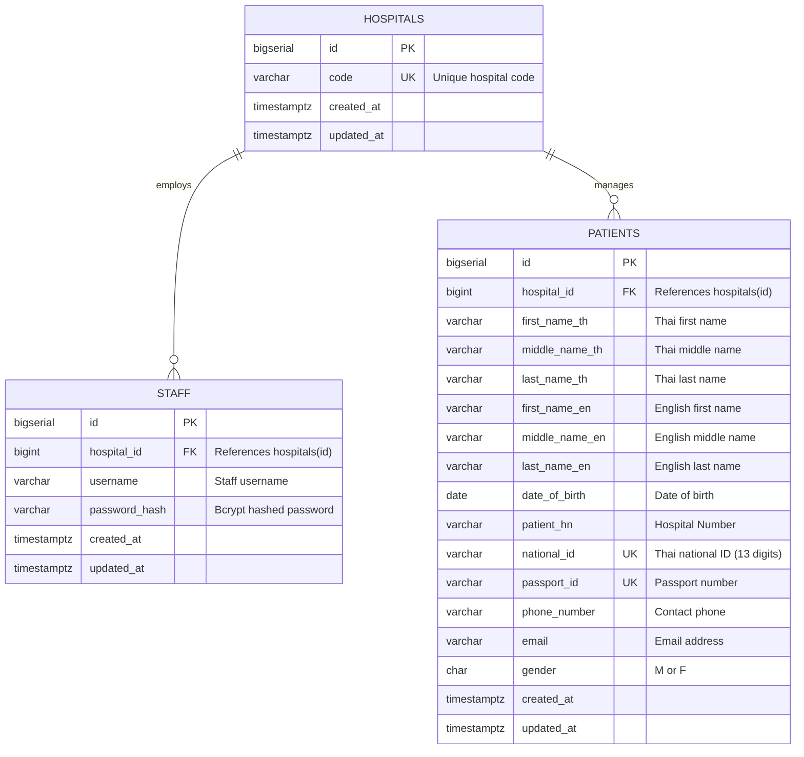

# Hospital Information Service - Entity Relationship Diagram

## Database Schema Overview

This document describes the database schema for the Hospital Information Service middleware system.

---

## ER Diagram (Mermaid)



---

## Table Specifications

### 1. hospitals
Central registry of all hospitals in the system.

| Column | Type | Constraints | Description |
|--------|------|-------------|-------------|
| id | BIGSERIAL | PRIMARY KEY | Auto-incrementing hospital identifier |
| code | VARCHAR(255) | NOT NULL, UNIQUE | Hospital code (e.g., "HOSPITAL_A") |
| created_at | TIMESTAMPTZ | NOT NULL, DEFAULT NOW() | Record creation timestamp |
| updated_at | TIMESTAMPTZ | NOT NULL, DEFAULT NOW() | Last update timestamp |

**Indexes:**
- Primary key on `id`
- Unique index on `code`

**Sample Data:**
```sql
INSERT INTO hospitals (code) VALUES ('HOSPITAL_A');
INSERT INTO hospitals (code) VALUES ('HOSPITAL_B');
```

---

### 2. staff
Staff members who can access the system, scoped to their hospital.

| Column | Type | Constraints | Description |
|--------|------|-------------|-------------|
| id | BIGSERIAL | PRIMARY KEY | Auto-incrementing staff identifier |
| hospital_id | BIGINT | NOT NULL, FK → hospitals(id) | Hospital association |
| username | VARCHAR(255) | NOT NULL | Staff username |
| password_hash | VARCHAR(255) | NOT NULL | Bcrypt hashed password |
| created_at | TIMESTAMPTZ | NOT NULL, DEFAULT NOW() | Record creation timestamp |
| updated_at | TIMESTAMPTZ | NOT NULL, DEFAULT NOW() | Last update timestamp |

**Indexes:**
- Primary key on `id`
- Unique composite index on `(username, hospital_id)` - ensures unique usernames per hospital
- Foreign key index on `hospital_id`

**Constraints:**
- `UNIQUE (username, hospital_id)` - Same username can exist in different hospitals
- `FOREIGN KEY (hospital_id) REFERENCES hospitals(id) ON DELETE CASCADE`

**Business Rules:**
- Password must be at least 8 characters (enforced at application layer)
- Password stored as bcrypt hash with cost factor 10
- Staff can only access patients from their own hospital

**Sample Data:**
```sql
INSERT INTO staff (hospital_id, username, password_hash)
VALUES (1, 'alice', '$2a$10$...');
```

---

### 3. patients
Patient records associated with hospitals.

| Column | Type | Constraints | Description |
|--------|------|-------------|-------------|
| id | BIGSERIAL | PRIMARY KEY | Auto-incrementing patient identifier |
| hospital_id | BIGINT | NOT NULL, FK → hospitals(id) | Hospital association |
| first_name_th | VARCHAR(255) | NULL | Thai first name |
| middle_name_th | VARCHAR(255) | NULL | Thai middle name |
| last_name_th | VARCHAR(255) | NULL | Thai last name |
| first_name_en | VARCHAR(255) | NULL | English first name |
| middle_name_en | VARCHAR(255) | NULL | English middle name |
| last_name_en | VARCHAR(255) | NULL | English last name |
| date_of_birth | DATE | NULL | Date of birth |
| patient_hn | VARCHAR(50) | NULL | Hospital Number |
| national_id | VARCHAR(13) | NULL | Thai national ID (13 digits) |
| passport_id | VARCHAR(50) | NULL | Passport number |
| phone_number | VARCHAR(50) | NULL | Contact phone number |
| email | VARCHAR(255) | NULL | Email address |
| gender | CHAR(1) | NULL, CHECK IN ('M','F') | Gender (M/F) |
| created_at | TIMESTAMPTZ | NOT NULL, DEFAULT NOW() | Record creation timestamp |
| updated_at | TIMESTAMPTZ | NOT NULL, DEFAULT NOW() | Last update timestamp |

**Indexes:**
- Primary key on `id`
- Index on `hospital_id` for hospital-scoped queries
- Partial unique index on `national_id WHERE national_id IS NOT NULL`
- Partial unique index on `passport_id WHERE passport_id IS NOT NULL`
- Index on `date_of_birth` for date range queries
- Composite index on `(last_name_en, first_name_en)` for name searches

**Constraints:**
- `UNIQUE (national_id) WHERE national_id IS NOT NULL` - National ID must be unique if provided
- `UNIQUE (passport_id) WHERE passport_id IS NOT NULL` - Passport ID must be unique if provided
- `CHECK (gender IN ('M', 'F'))` - Gender must be M or F if provided
- `FOREIGN KEY (hospital_id) REFERENCES hospitals(id) ON DELETE CASCADE`

**Business Rules:**
- All personal information fields are optional (nullable)
- At least one identifier (national_id or passport_id) recommended for external API integration
- Name fields support both Thai and English
- Phone numbers stored as strings to preserve formatting
- Email addresses should be validated at application layer

**Sample Data:**
```sql
INSERT INTO patients (hospital_id, first_name_en, last_name_en, national_id, gender)
VALUES (1, 'Somchai', 'Jaidee', '1234567890123', 'M');
```

---

## Relationships

### 1. hospitals ↔ staff
- **Type**: One-to-Many
- **Cardinality**: One hospital has zero or more staff members
- **Foreign Key**: `staff.hospital_id → hospitals.id`
- **Delete Behavior**: CASCADE (deleting hospital removes all staff)
- **Business Logic**: Staff members belong to exactly one hospital

### 2. hospitals ↔ patients
- **Type**: One-to-Many
- **Cardinality**: One hospital manages zero or more patients
- **Foreign Key**: `patients.hospital_id → hospitals.id`
- **Delete Behavior**: CASCADE (deleting hospital removes all patient records)
- **Business Logic**: Patients belong to exactly one hospital in the system

---

## Index Strategy

### Performance Indexes

1. **staff(username, hospital_id)** - Unique composite
   - Purpose: Fast staff login queries
   - Query: `SELECT * FROM staff WHERE username = ? AND hospital_id = ?`

2. **patients(hospital_id)** - Non-unique
   - Purpose: Hospital-scoped patient searches
   - Query: `SELECT * FROM patients WHERE hospital_id = ?`

3. **patients(national_id)** - Partial unique (WHERE NOT NULL)
   - Purpose: Fast ID lookups, enforce uniqueness
   - Query: `SELECT * FROM patients WHERE national_id = ?`

4. **patients(passport_id)** - Partial unique (WHERE NOT NULL)
   - Purpose: Fast passport lookups, enforce uniqueness
   - Query: `SELECT * FROM patients WHERE passport_id = ?`

5. **patients(date_of_birth)** - Non-unique
   - Purpose: Date range searches
   - Query: `SELECT * FROM patients WHERE date_of_birth = ?`

6. **patients(last_name_en, first_name_en)** - Composite non-unique
   - Purpose: Name-based searches
   - Query: `SELECT * FROM patients WHERE last_name_en ILIKE ? AND first_name_en ILIKE ?`

---

## Data Integrity Rules

### Referential Integrity
- All foreign keys enforce referential integrity
- Cascade deletes maintain consistency
- Cannot create staff/patient without valid hospital

### Uniqueness Constraints
- Hospital codes must be globally unique
- Staff usernames must be unique within each hospital
- National IDs must be globally unique (when provided)
- Passport IDs must be globally unique (when provided)

### Check Constraints
- Gender values restricted to 'M' or 'F'
- All constraints enforced at database level

### Application-Level Validations
- Password minimum length (8 characters)
- Password complexity requirements
- Email format validation
- Phone number format validation
- National ID format (13 digits)

---

## Database Migration Strategy

### Initial Setup
```sql
-- 001_init.sql
CREATE TABLE hospitals (...);
CREATE TABLE staff (...);
CREATE TABLE patients (...);
CREATE INDEX idx_staff_hospital ON staff(hospital_id);
CREATE UNIQUE INDEX idx_staff_username_hospital ON staff(username, hospital_id);
-- ... more indexes
```

### Sample Data
```sql
-- 002_sample_data.sql
INSERT INTO hospitals (code) VALUES ('HOSPITAL_A') ON CONFLICT DO NOTHING;
INSERT INTO hospitals (code) VALUES ('HOSPITAL_B') ON CONFLICT DO NOTHING;
```

---

## Query Patterns

### Common Queries

1. **Staff Authentication**
```sql
SELECT s.id, s.username, s.hospital_id, h.code as hospital
FROM staff s
JOIN hospitals h ON h.id = s.hospital_id
WHERE s.username = $1 AND s.hospital_id = (
    SELECT id FROM hospitals WHERE code = $2
);
```

2. **Patient Search (Hospital-Scoped)**
```sql
SELECT * FROM patients
WHERE hospital_id = $1
  AND ($2::VARCHAR IS NULL OR national_id = $2)
  AND ($3::VARCHAR IS NULL OR passport_id = $3)
  AND ($4::VARCHAR IS NULL OR first_name_en ILIKE '%' || $4 || '%')
LIMIT 100;
```

3. **Create/Update Patient (Upsert)**
```sql
INSERT INTO patients (hospital_id, national_id, first_name_en, ...)
VALUES ($1, $2, $3, ...)
ON CONFLICT (national_id) WHERE national_id IS NOT NULL
DO UPDATE SET 
    first_name_en = EXCLUDED.first_name_en,
    updated_at = NOW();
```

---

## Scalability Considerations

### Partitioning Strategy (Future)
- Consider partitioning `patients` table by `hospital_id` for large deployments
- Each hospital's data could be isolated into separate partitions

### Replication
- Read replicas for search-heavy workloads
- Primary for write operations

### Archival
- Soft delete pattern for patient records
- Archive old records to separate tables

---

## Security Considerations

### Data Protection
- Password hashes stored using bcrypt (cost 10)
- Sensitive PII (national_id, passport_id) should be encrypted at rest (future enhancement)
- Database credentials managed via environment variables
- Connection pooling configured with max 10 connections

### Access Control
- Application enforces hospital-scoped access
- Database user has minimal required privileges
- No direct database access for end users
- All access through application APIs

### Audit Trail
- `created_at` and `updated_at` timestamps on all tables
- Future enhancement: audit log table for changes

---

## Database Technology

### PostgreSQL 16
- **Connection**: pgx/v5 driver with connection pooling
- **Pool Configuration**:
  - Max connections: 10
  - Min connections: 2
  - Max connection lifetime: 30 minutes
  - Max idle time: 5 minutes
  - Health check period: 1 minute

### Docker Configuration
```yaml
postgres:
  image: postgres:16-alpine
  environment:
    POSTGRES_DB: hospital_db
    POSTGRES_USER: hospital_user
    POSTGRES_PASSWORD: hospital_password
  volumes:
    - postgres_data:/var/lib/postgresql/data
    - ./db/init:/docker-entrypoint-initdb.d
  ports:
    - "5432:5432"
```
